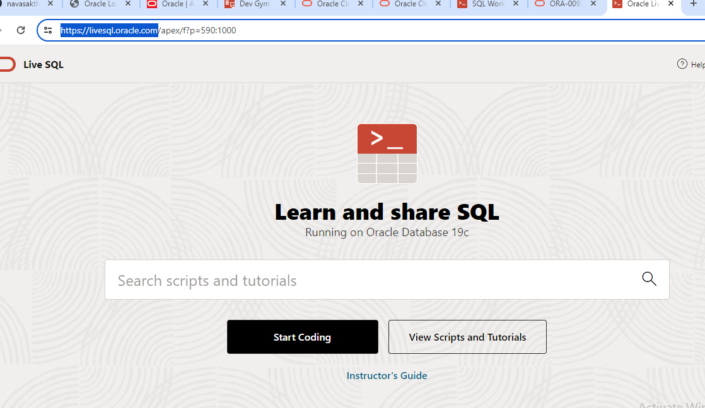
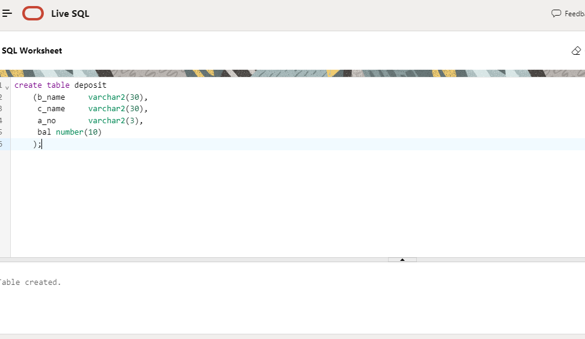

# RDBMS-LAB

### to practice these sql follow the below instructions

- step 1 
    - click on the below link
    - https://livesql.oracle.com/
- step 2 
    - click on start coding  
    - 

- step 3
    - after signing in type your sql queries in the box
    - 